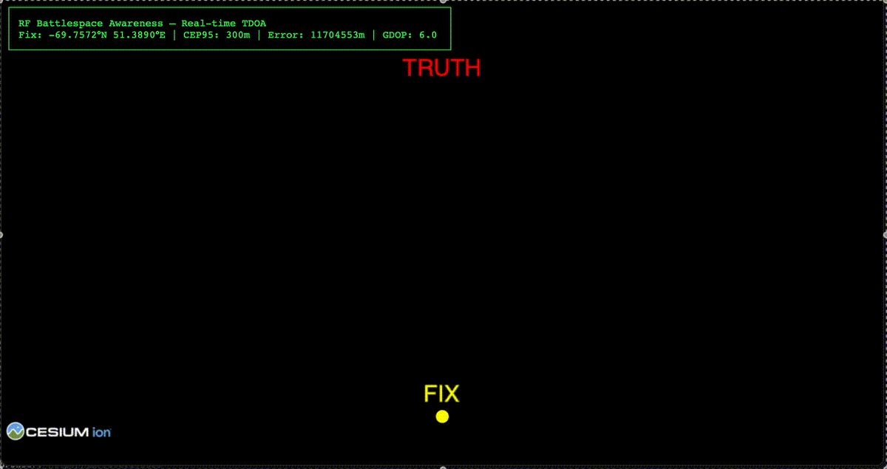
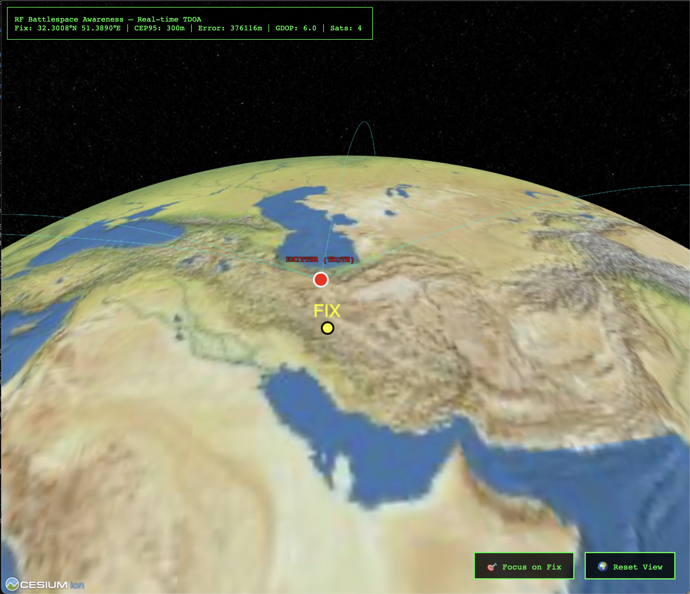
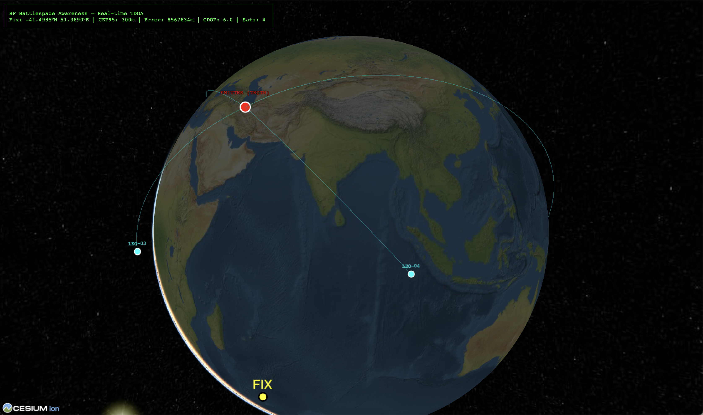

# RF Battlespace Awareness Simulator

> Real-time RF emitter geolocation using TDOA (Time Difference of Arrival) multilateration with simulated LEO satellite constellations

[](https://www.python.org/downloads/)
[](LICENSE)


*Live TDOA geolocation with real-time updates every 5 seconds*

## Overview

This simulator demonstrates **passive RF geolocation** using time-difference-of-arrival (TDOA) measurements from a constellation of LEO satellites (similar to Starlink). The system can detect and locate ground-based RF emitters with sub-kilometer accuracy under ideal conditions.

### Key Features

- **TDOA Geolocation**: Multilateration algorithm with iterative least squares solver
- **Satellite Simulation**: Realistic LEO constellation orbital mechanics using Skyfield
- **Real-time Visualization**: Web-based 3D interface with live geolocation updates
- **Interactive Controls**: Focus on fix location and reset view buttons
- **Accuracy Metrics**: CEP95 (Circular Error Probable) uncertainty quantification
- **Coordinate Systems**: ECEF <-> LLA transformations with WGS84 geodetic reference

### Example Scenarios

#### Good Satellite Geometry

*Accurate fix with 4 satellites and optimal geometry - CEP95 ~300m, error ~9m*

#### Poor Satellite Geometry

*Degraded accuracy with suboptimal satellite constellation geometry - demonstrates GDOP impact*

## Quick Start

### Installation

```bash
# Using uv (recommended)
uv sync

# Or using pip
pip install -r requirements.txt
```

### Architecture

```
+------------------+
|  Emitter Layer   |  Ground-based RF transmitter
+--------+---------+
         |
         | RF Signal Propagation
         v
+--------+---------+
|  Sensor Layer    |  LEO satellite constellation (4+ satellites)
+--------+---------+
         |
         | Time-of-Arrival Measurements
         v
+--------+---------+
| Algorithm Layer  |  TDOA multilateration solver
+--------+---------+
         |
         | Position Fix + Uncertainty
         v
+--------+---------+
| Visualization    |  Web-based map interface
+------------------+
```

### Coordinate Systems

- **ECEF** (Earth-Centered Earth-Fixed): 3D Cartesian coordinates for internal calculations
  - Origin: Earth's center of mass
  - X-axis: Intersection of equator and prime meridian
  - Z-axis: North pole

- **LLA** (Latitude, Longitude, Altitude): Geographic coordinates for user interface
  - Latitude: [-90°, 90°] (South to North)
  - Longitude: [-180°, 180°] (West to East)
  - Altitude: Meters above WGS84 ellipsoid

## Project Structure

```
rf-battlespace-awareness-simulator/
├── core/
│   ├── coordinate_systems.py    # ECEF <-> LLA transformations
│   └── constants.py             # Physical constants (c, R_earth, etc.)
├── emitters/
│   └── base_emitter.py          # RF emitter simulation
├── sensors/
│   └── rf_sensor.py             # Satellite sensor with orbital dynamics
├── algorithms/
│   └── tdoa_solver.py           # TDOA multilateration algorithm
├── visualization/
│   ├── app.py                   # FastAPI web server
│   ├── index.html               # Web interface
│   └── static/                  # CSS, JS, assets
├── main.py                      # Entry point
├── run_demo.py                  # Demo script
└── pyproject.toml               # Dependencies
```

## Performance

### Accuracy

- **Ideal Conditions** (4 satellites, good geometry): CEP95 ≈ 300-500 m
- **Realistic Conditions** (measurement noise): CEP95 ≈ 500-1500 m
- **Poor Geometry** (coplanar satellites): CEP95 > 5 km

### Real-time Capability

- **Geolocation Update Rate**: <1 second per fix
- **Web Visualization**: Real-time updates via FastAPI

### Limitations

- **Minimum Satellites**: Requires ≥4 satellites with good geometric diversity
- **GDOP Sensitivity**: Accuracy degrades with poor satellite geometry
- **Atmospheric Effects**: Not modeled (ionospheric/tropospheric delays)
- **Clock Synchronization**: Assumes perfect satellite time synchronization

## Technical Details

### TDOA Algorithm

The solver uses **iterative weighted least squares** (Gauss-Newton method):

1. **Linearization**: Taylor expansion around initial guess
2. **Weighting**: Covariance matrix from measurement noise
3. **Iteration**: Refine position estimate until convergence
4. **Uncertainty**: CEP95 computed from final covariance matrix

### Satellite Orbital Mechanics

- **Altitude**: 550 km (typical LEO)
- **Inclination**: 53° (Starlink-like)
- **Orbital Period**: ~95 minutes
- **Constellation**: 4 satellites in orthogonal RAAN planes

### Performance Metrics

- **CEP95**: 95% Circular Error Probable (radius containing 95% of fixes)
- **GDOP**: Geometric Dilution of Precision (satellite geometry quality)
- **Convergence Time**: Number of iterations to solution

## Roadmap

- [x] 3D visualization with satellite positions
- [ ] Multi-emitter tracking with data association
- [ ] FDOA (Frequency Difference of Arrival) integration
- [ ] Kalman filtering for trajectory prediction
- [ ] Advanced noise models (ionospheric, tropospheric)
- [ ] Real-time constellation optimization
- [ ] WebSocket streaming for live updates
- [ ] Performance benchmarking suite
- [ ] Automated testing suite

## Contributing

Contributions welcome!

1. Fork the repository
2. Create feature branch: `git checkout -b feature/amazing-feature`
3. Commit changes: `git commit -m 'feat: add amazing feature'`
4. Push to branch: `git push origin feature/amazing-feature`
5. Open Pull Request

## License

Apache License 2.0 - see [LICENSE](LICENSE) for details

## References

- **TDOA Theory**: Schmidt, R.O. (1996). "Least squares range difference location"
- **Satellite Orbits**: Vallado, D.A. (2013). "Fundamentals of Astrodynamics and Applications"
- **Geodesy**: Hofmann-Wellenhof, B. (2007). "GNSS - Global Navigation Satellite Systems"
- **Skyfield**: [https://rhodesmill.org/skyfield/](https://rhodesmill.org/skyfield/)

---

**This simulator demonstrates passive RF geolocation principles for research and professional development in the space-based signal intelligence domain.**
